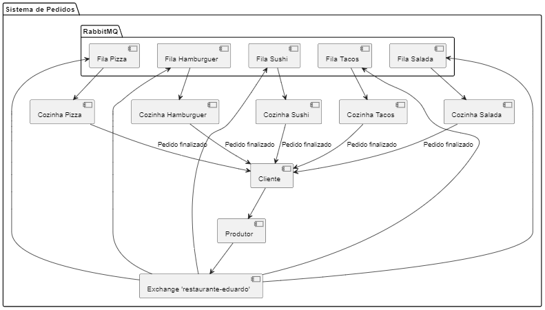
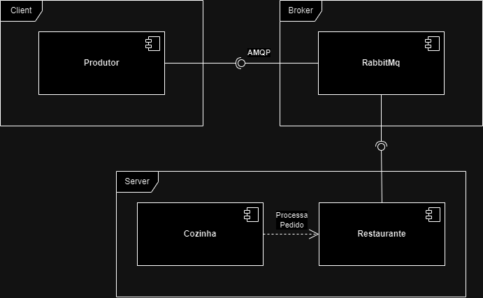

# Sistema de Gerenciamento de Pedidos de Restaurantes

Este repositório contém a implementação de um sistema distribuído de gerenciamento de pedidos para uma rede de restaurantes, utilizando RabbitMQ como ferramenta de comunicação entre o **produtor** (sistema de pedidos) e o **restaurante** onde contem cozinhas especializadas. O sistema garante o roteamento de pedidos para diferentes cozinhas com base na especialização da cozinha.

## Índice

- [Visão Geral](#visão-geral)
- [Fluxo de Comunicação](#fluxo-de-comunicação)
- [Diagrama de Componentes](#diagrama-de-componentes)
- [Instruções de Execução](#instruções-de-execução)
- [Variáveis de Ambiente](#variáveis-de-Ambiente)

---

## Visão Geral

Neste sistema, o **produtor** representa o sistema de pedidos do cliente, que envia diferentes tipos de refeições (como Pizza, Hambúrguer, Sushi, Salada e Tacos) para a fila central de pedidos. As **cozinhas** são representadas pelos **consumidores**, cada um responsável por processar um tipo específico de pedido. A comunicação entre esses componentes é feita por meio de tópicos no RabbitMQ, garantindo que cada pedido seja entregue para a cozinha correta.

### Componentes principais:

- **Produtor**: Envia pedidos para a fila, atribuindo uma `routingKey` com base no tipo de refeição.
- **Restaurante (Cozinhas)**: Recebem e processam os pedidos, simulando o tempo de preparo das refeições.
- **RabbitMQ**: Gerencia as filas e garante que os pedidos sejam entregues às cozinhas corretas.

---

## Fluxo de Comunicação

1. O **Produtor** gera uma série de pedidos aleatórios, como "Pizza", "Hambúrguer", "Sushi", etc., e envia para a **exchange** `restaurante-eduardo` no RabbitMQ.
2. Cada **pedido** é enviado com uma `routingKey` no formato `pedido.<tipo_de_refeição>`, como `pedido.pizza`, `pedido.hamburguer`, etc.
3. O RabbitMQ roteia o pedido para a fila apropriada com base na `routingKey`.
4. Cada **Cozinha** está vinculado à fila correspondente ao seu tipo especializado e processa os pedidos em ordem de chegada (FIFO - First In, First Out).
5. Após processar o pedido, a **cozinha** notifica o pedido como concluído.



---

## Diagrama de Componentes



## Instruções de execução

Para garantir que o sistema funcione corretamente, siga a sequência de inicialização abaixo:

1. Inicialize as Cozinhas
   Antes de iniciar o produtor, você deve iniciar o sistema de gerenciamento de pedidos, que inicializa as cozinhas. Isso pode ser feito executando a classe Restaurante. Essa classe configura e inicia as cozinhas que ficarão ouvindo as filas apropriadas no RabbitMQ.
2. Inicie o Produtor
   Depois que as cozinhas estiverem prontas e ouvindo as filas, você pode iniciar o produtor para enviar os pedidos. A classe Produtor enviará pedidos para a exchange restaurante-eduardo no RabbitMQ.

## Variáveis de Ambiente

Certifique-se de que as variáveis de ambiente estão configuradas corretamente no arquivo de configuração localizado no diretório `resources` do projeto.

```env
RABBITMQ_HOST=amqp://localhost
```
